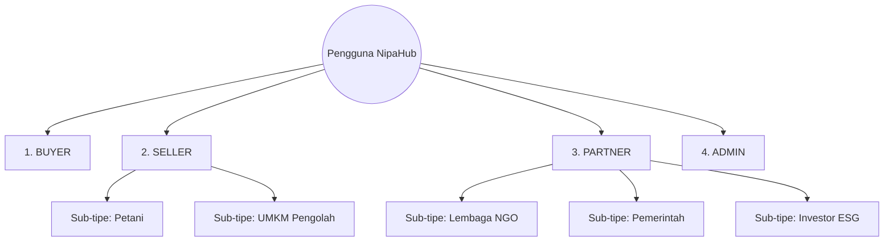
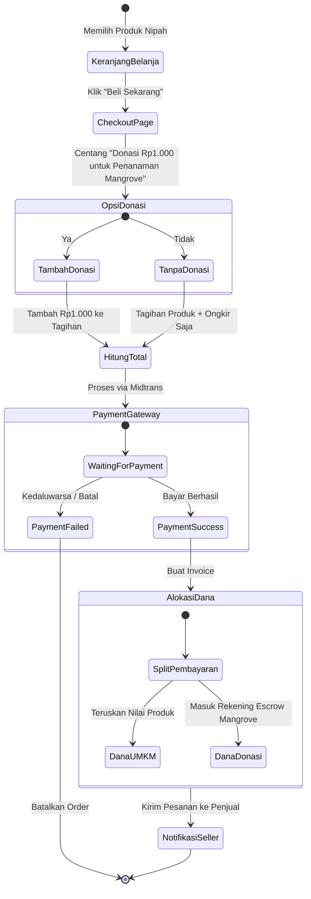
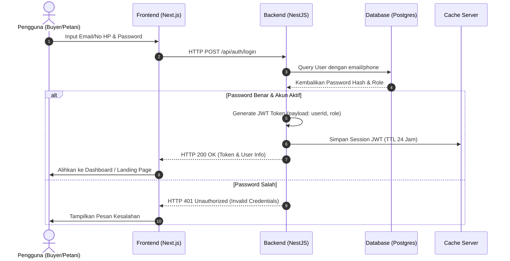
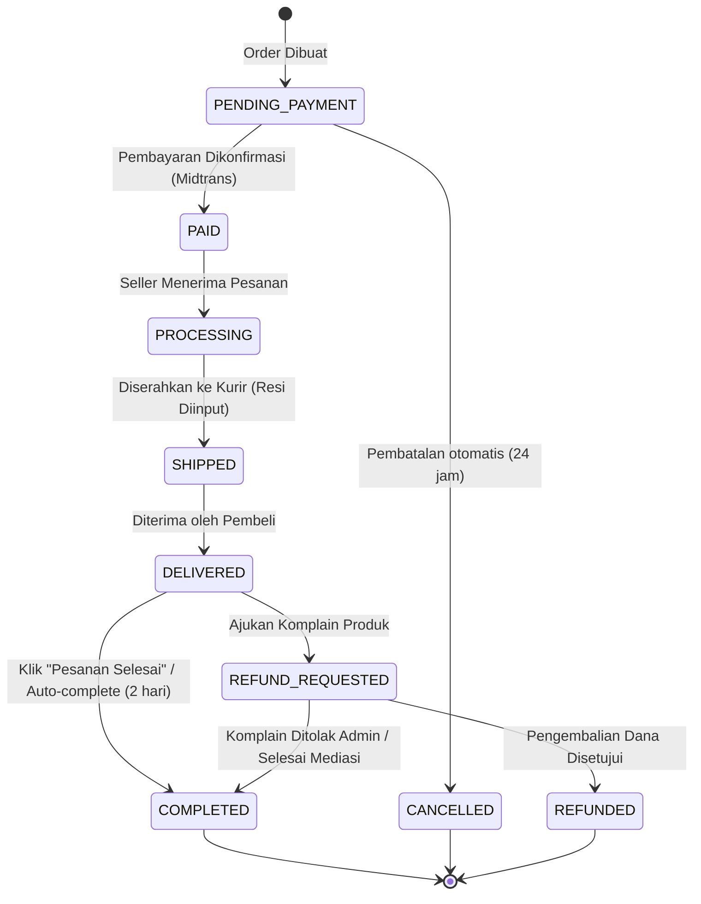
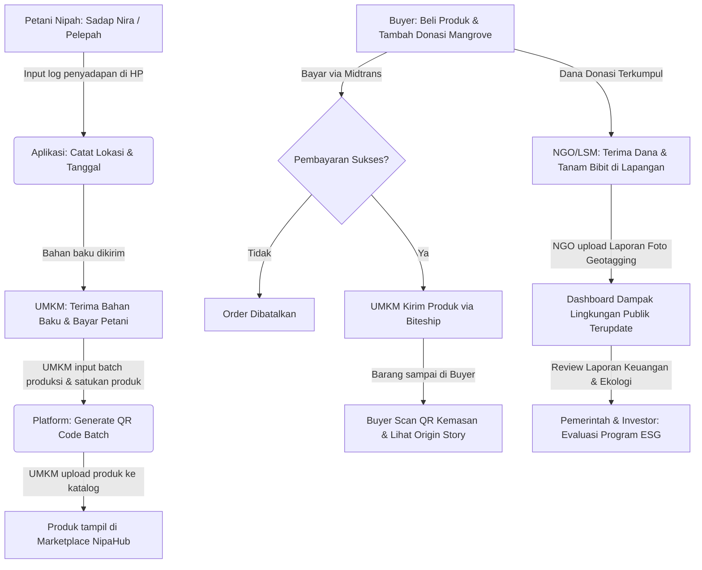

# Generate Project Coding Rules (README.md)

Saya sedang mengembangkan sebuah proyek bernama **NipaHub**, sebuah platform digital dan marketplace yang menghubungkan petani nipah, UMKM, dan konsumen dalam satu ekosistem terintegrasi.

Buatkan sebuah file **README.md** yang berfungsi sebagai **Coding Rules, Architecture Guide, dan Design System Documentation** untuk seluruh tim developer.

README harus ditulis secara profesional, lengkap, dan mudah dipahami oleh developer baru yang bergabung ke proyek.

---

# Project Context

## Product Name

NipaHub

## Project Overview

NipaHub adalah platform digital yang menghubungkan petani nipah, UMKM, dan konsumen melalui marketplace, edukasi, promosi produk, serta pemberdayaan masyarakat pesisir.

## Design Identity

Theme: Coastal Heritage Modernism

Karakter desain:

* Modern
* Profesional
* Bersih (Clean UI)
* Flat Design
* Warm & Natural
* Merepresentasikan identitas pesisir Indonesia

### Color Palette

Primary:

* Maroon Nipah (#6B3E3D)

Secondary:

* Earth Brown (#8A5A44)
* Sand Beige (#E8DCCB)
* Cream White (#F8F4EE)
* Mangrove Green (#6B8E5D)
* Soft Gold (#C9A86A)

### Typography

Heading:

* Playfair Display

Body:

* Inter

---

# README Content Requirements

Buat dokumentasi yang mencakup:

## 1. Project Structure

Tentukan struktur folder yang scalable untuk proyek modern berbasis Next.js + TypeScript.

Contoh:

```
src/
├── app/
│ ├── (pages)/
│ │ ├── (auth)/
│ │ │ ├── login/
│ │ │ ├── register/
│ │ │ ├── forgot-password/
│ │ │ └── reset-password/
│ │ └── (private)/
│ │   ├── admin/
│ │   ├── pembeli/
│ │   └── petani/
│ ├── components/
│ │ ├── ui/
│ │ ├── common/
│ │ ├── marketplace/
│ │ ├── dashboard/
│ │ └── landing/
│ ├── features/
│ ├── hooks/
│ ├── services/
│ ├── lib/
│ ├── store/
│ ├── types/
│ ├── constants/
│ ├── styles/
│ ├── assets/
│ └── utils/
```

Jelaskan fungsi masing-masing folder.

---

## 2. Naming Convention

Buat aturan penamaan untuk:

### Folder

* kebab-case

Contoh:

* product-card
* marketplace-filter

### Component

* PascalCase

Contoh:

* ProductCard.tsx
* MarketplaceFilter.tsx

### Hooks

* useSomething

Contoh:

* useAuth.ts
* useProducts.ts

### Utility

* camelCase

Contoh:

* formatCurrency.ts
* calculateImpact.ts

### Constants

* UPPER_SNAKE_CASE

Contoh:

* PRODUCT_CATEGORY
* USER_ROLE

---

## 3. Component Architecture Rules

Jelaskan:

* Atomic Design approach
* Reusable Components First
* Separation of Business Logic
* Smart vs Dumb Components
* Composition Pattern

Berikan contoh mana yang boleh dan tidak boleh dilakukan.

---

## 4. UI/UX Rules

Buat aturan desain yang ketat.

### WAJIB

✓ Flat Design

✓ Consistent Spacing System

✓ Sharp or Minimal Border Radius (`rounded-none` atau `rounded-sm`)

✓ Responsive Design

✓ Accessibility

✓ Mobile First

✓ Reusable Components

✓ Semantic HTML

✓ Loading State

✓ Empty State

✓ Error State

✓ Skeleton Loading

### DILARANG

✗ Lengkungan berlebihan / Bulat (`rounded-full`, `rounded-xl`, `rounded-3xl` tidak diizinkan kecuali untuk badge/icon wrapper spesifik)

✗ Glassmorphism berlebihan

✗ Neumorphism

✗ Terlalu banyak warna

✗ Shadow berlebihan

✗ Gradient berlebihan

✗ Random spacing

✗ Inline Styling

✗ Hardcoded Color

✗ Hardcoded Margin

✗ Hardcoded Width

✗ Duplicate Components

---

## 5. Design System Rules

Tentukan:

### Spacing Scale

4px
8px
12px
16px
24px
32px
48px
64px

### Border Radius

sm = 8px
md = 12px
lg = 16px
xl = 24px

### Shadow Usage

Gunakan shadow hanya untuk:

* Modal
* Dropdown
* Floating Card

Selain itu gunakan border.

---

## 6. Code Quality Rules

Wajib:

* TypeScript Strict Mode
* ESLint
* Prettier
* Husky
* Conventional Commit
* Clean Code Principle

### Jangan lakukan:

❌ any type

❌ nested ternary

❌ duplicated code

❌ magic numbers

❌ hardcoded string

❌ unused imports

❌ console.log di production

---

## 7. State Management Rules

Jelaskan kapan menggunakan:

* Local State
* Context
* Zustand
* React Query

Berikan best practices.

---

## 8. API Layer Rules

Pisahkan:

```
services/
├── auth.service.ts
├── product.service.ts
├── impact.service.ts
```

Jangan memanggil API langsung dari component.

---

## 9. Git Workflow Rules

Branch Naming:

feature/
bugfix/
hotfix/
refactor/

Contoh:

feature/product-marketplace
feature/impact-dashboard
bugfix/login-error

Commit Format:

feat:
fix:
refactor:
style:
docs:
test:
chore:

---

## 10. Marketplace-Specific Components

Definisikan standar komponen untuk:

* Product Card
* Product Detail
* Marketplace Filter
* Farmer Profile
* Impact Dashboard Card
* SDG Badge
* Traceability Timeline
* Verification Badge

---

## 11. Performance Rules

Wajib:

* Lazy Loading
* Dynamic Import
* Image Optimization
* Code Splitting
* Memoization bila diperlukan

Dilarang:

* Over Optimization
* Premature Optimization

---

## 12. Accessibility Rules

Minimal WCAG AA

Wajib:

* aria-label
* keyboard navigation
* focus state
* alt image
* semantic tags

---

## 13. Responsive Breakpoints

Mobile:
0 - 767px

Tablet:
768 - 1023px

Desktop:
1024px+

---

## 14. Final Golden Rules

Buat section khusus berisi 20 aturan utama yang wajib dipatuhi seluruh developer.

Tujuan utama:

* Scalability
* Maintainability
* Consistency
* Consistency
* Reusability
* Professional Production-Ready Code

## 15. Agent Working Guidelines (Refined)

Berdasarkan kesepakatan terbaru dengan pengembang utama, agen AI yang mengerjakan proyek ini **WAJIB** mengingat dan menerapkan prinsip berikut setiap kali melakukan *slicing* atau pengkodean:

1. **Strict Component-Based Architecture:** Jangan pernah menumpuk kode (monolith) di dalam file `page.tsx`. File halaman (`page.tsx`) hanya boleh menjadi *layout grid/wrapper* yang memanggil fungsi-fungsi komponen terpisah.
2. **Folder Komponen Spesifik:** Segera buat folder penampung komponen yang relevan di dalam `src/components/` (misalnya `src/components/pembeli/` atau `src/components/checkout/`) untuk setiap fitur baru.
3. **Pemisahan Data Mock/Dummy:** Saat proses *slicing* awal yang belum ada API backend, JANGAN melakukan *hardcode* data langsung di dalam komponen atau halaman. Semua data statis/dummy wajib diekstrak dan disimpan di dalam folder `constants/` (misalnya `src/constants/dummyData.ts`).
4. **DRY via Layouts:** Manfaatkan fitur `layout.tsx` pada Next.js (App Router) secara maksimal. Halaman anak yang membutuhkan *Navbar* atau *Footer* yang sama wajib diletakkan di dalam *route group* atau *sub-folder* yang sama agar mewarisi *layout* tanpa perlu memanggil komponen struktur tersebut berulang kali di setiap halaman.

Output harus berupa README.md lengkap yang siap digunakan sebagai standar coding dan desain seluruh proyek NipaHub.

---

# NIPAHUB SYSTEM SPECIFICATIONS (PRD & SRS)
*Visi Ekonomi Biru, Ketertelusuran Produk, dan Pemberdayaan Pesisir*

Berikut adalah hasil analisis dan spesifikasi lengkap PRD & SRS untuk NipaHub.

## 1. Problem Statement
- **Ekonomi:** Rantai pasok nipah panjang, petani dieksploitasi tengkulak, tidak ada akses pasar digital langsung.
- **Keberlanjutan:** Kurangnya insentif ekonomi untuk melindungi hutan nipah/mangrove dari alih fungsi lahan.
- **Transparansi:** Pembeli modern menuntut bukti ketertelusuran asal produk ramah lingkungan (*fair trade*).
- **Teknologi:** Kesenjangan digital masyarakat pesisir dalam mengelola keuangan dan inventori.

## 2. Business Goal, Vision, & Mission
- **Visi:** Menjadi ekosistem digital ekonomi nipah berkelanjutan, memelopori transformasi ekonomi biru dan kemakmuran masyarakat pesisir Nusantara.
- **Misi:** 
  1. *Sustainable Marketplace* produk olahan nipah.
  2. *Traceability* (ketertelusuran) dari petani hingga konsumen.
  3. Integrasi *Circular Blue Economy* (limbah jadi bernilai).
  4. Kolaborasi multi-stakeholder (NGO, CSR, Akademisi, Pemerintah).
- **Goal:** Mendigitalkan 500+ petani nipah dan 50+ UMKM di Aceh (Tahun 1), ekspansi nasional & modul investasi dampak (Tahun 2-3).

## 3. Success Metrics
- **Bisnis:** GMV Rp 1.5 Miliar (Tahun 1), CAC < Rp 50.000, Repeat Purchase > 25%.
- **Dampak Sosial:** Peningkatan pendapatan mitra (+40%), reboisasi 50 Hektar hutan mangrove terverifikasi.
- **Teknis:** Kecepatan muat halaman (LCP) < 2 detik, Uptime ketersediaan sistem 99.9%, zero security breaches.

## 4. Stakeholder & User Role Simplification (4 Core Roles)

NipaHub memotong kompleksitas peran dari 8 peran menjadi **4 Peran Utama** untuk mempercepat durasi pengerjaan kompetisi:



1.  **BUYER (Pembeli):** Belanja, melacak pesanan, donasi, serta memantau histori jejak karbon hijau.
2.  **SELLER (Mitra Produsen):** Menyatukan peran Petani dan UMKM. Memasarkan produk nipah/kerajinan dan mencatat batch asal-usul bahan baku.
3.  **PARTNER (External Impact Partner):** Menyatukan NGO, Pemerintah, dan Investor. Bertugas mengelola donasi penanaman bakau, mengunggah bukti geotagging, dan membaca analisis data keberlanjutan.
4.  **ADMIN (Administrator):** Verifikasi data Seller/Partner, moderasi konten, kurasi sertifikat produk, dan manajemen audit trail donasi.

## 5. User Persona & Empathy Map
### Pak Basri (Petani Nipah, 45 Tahun - SELLER Sub-type: FARMER)
- **Goals:** Mendapat harga jual nira nipah yang adil untuk membiayai keluarga.
- **Pain Points:** Terjerat tengkulak lokal, gap teknologi, terbiasa pembayaran tunai.

### Sarah Wijaya (Eco-Conscious Buyer, 29 Tahun - BUYER)
- **Goals:** Membeli pemanis indeks glikemik rendah (gula nipah) yang terverifikasi etis & membantu ekologi pesisir.
- **Pain Points:** Banyak klaim hijau palsu (*greenwashing*), donasi sosial tidak transparan.

## 6. User Journey & Proses Bisnis (As-Is vs To-Be)
- **User Journey:** Discovery (sosmed NipaHub) -> Evaluasi (cek Traceability Timeline produk) -> Purchase (checkout + donasi mangrove via Midtrans) -> Post-Purchase (scan QR kemasan, lihat origin story, update kontribusi CO2).
- **As-Is (Rantai Pasok Lama):** Petani -> Tengkulak -> Pengepul -> UMKM -> Konsumen (Petani hanya menerima 5-10% keuntungan).
- **To-Be (NipaHub):** Petani memasok bahan baku dengan upah adil & tercatat di sistem -> UMKM memproses & merekam batch -> Pembeli membeli secara transparan -> NGO menyalurkan donasi penanaman -> Laporan dampak terupdate real-time.

## 7. Value Proposition & MoSCoW Prioritization
- **Must Have:** Registrasi Multi-Role, Katalog Produk, Keranjang & Checkout, Midtrans & Biteship, Lini Masa Traceability sederhana (Input batch & QR), Manajemen profil toko Seller.
- **Should Have:** Dasbor Partner, *Micro-donation* saat checkout, Real-time Chat.
- **Could Have:** AI Demand Forecasting untuk UMKM, Peta Sebaran Tanaman Geotagging Mapbox, Modul Ekspor B2B Kontainer.
- **Won't Have:** Tokenisasi Karbon di Public Blockchain (digantikan database audit log terenkripsi dulu).

## 8. Functional Requirements per Modul
- **Auth (AUTH):** Registrasi 4-role (ADMIN, SELLER, BUYER, PARTNER), OAuth Google.
- **Marketplace (MKT):** Katalog, varian produk, tag sertifikasi (BPOM, Halal, Fair-Trade), filter ramah lingkungan.
- **Traceability (TRC):** Pencatatan asal nira petani, pembuatan kode batch, generator QR Code, widget Lini Masa publik.
- **Donasi & CSR (DON):** Kampanye reboisasi pesisir oleh Partner-NGO, pelaporan foto geotagging, kalkulasi offset emisi karbon.
- **AI & Analytics (AIAN):** AI Recommendation produk rendah karbon, AI Demand Forecasting stok nira untuk Seller.

## 9. Non-Functional Requirements (NFR)
- **Performance:** Skor Google Lighthouse minimum 90/100, response time API < 200ms.
- **Availability:** SLA 99.9% uptime dengan dukungan database read-replicas.
- **Security:** HTTPS TLS 1.3, bcrypt password hashing, API Rate Limiting (100 req/min), audit trail log terenkripsi.
- **Accessibility:** WCAG 2.1 AA compliant, responsive layout (mobile-first 360px+).

## 10. Role & Permission Matrix

| Role | Produk (`/api/products`) | Ketertelusuran (`/api/traceability`) | Transaksi Order (`/api/orders`) | Donasi & Kampanye (`/api/campaigns`) | Dasbor Laporan Keuangan |
| :--- | :--- | :--- | :--- | :--- | :--- |
| **ADMIN** | CRUD (Penuh) | CRUD (Penuh) | CRUD (Penuh) | CRUD (Penuh) | Ya (Seluruh Platform) |
| **SELLER** | CRUD (Milik Sendiri) | CRUD (Milik Sendiri) | Read, Update (Pesan Masuk) | Read Only | Ya (Statistik Toko) |
| **BUYER** | Read Only | Read Only | Create, Read (Milik Sendiri) | Create (Bayar Donasi) | Tidak |
| **PARTNER**| Read Only | Read Only | Tidak | CRUD (Kampanye Sendiri) | Ya (Statistik ESG/Dampak) |

## 11. Database Schema & Relasi (ERD)

```
[users] 1 -- 0..1 [seller_profiles] / [partner_profiles]
[seller_profiles] 1 -- 0..* [products]
[products] 1 -- 0..* [traceability_logs] (Batch produksi & panen bahan baku)
[orders] 1 -- 1 [payments]
[orders] 1 -- 1 [shipping_details]
[orders] 1 -- 1..* [order_items] 
[products] 1 -- 0..* [order_items]
[campaigns] 1 -- 0..* [donations]
[users] 1 -- 0..* [donations]
```

- **One-to-One (1:1):** `users` ↔ `seller_profiles`, `users` ↔ `partner_profiles`, `orders` ↔ `payments`, `orders` ↔ `shipping_details`.
- **One-to-Many (1:N):** `seller_profiles` ↔ `products`, `users` ↔ `orders`, `campaigns` ↔ `donations`.
- **Many-to-Many (N:M):** `users` ↔ `roles` (via `user_roles`), `products` ↔ `orders` (via `order_items` dengan quantity).

## 12. API Design & Integrasi Eksternal (Developer-Friendly)

Semua endpoint backend harus merespons dengan **Unified Response Wrapper** untuk mempermudah integrasi frontend:

- **Format Sukses:** `{ "success": true, "message": "...", "data": { ... } }`
- **Format Gagal:** `{ "success": false, "error": { "code": "ERR_CODE", "message": "..." } }`

### REST Endpoints
- **`/api/auth/register` (POST):** Registrasi role `BUYER`, `SELLER`, `PARTNER`.
- **`/api/auth/login` (POST):** Mengembalikan token JWT untuk session.
- **`/api/products` (GET/POST):** Katalog produk / tambah produk baru (Seller/Admin).
- **`/api/traceability/batch/:code` (GET):** Riwayat perjalanan produk dari petani ke UMKM.
- **`/api/orders` (POST):** Membuat transaksi pesanan dan donasi lingkungan.
- **`/api/orders/webhook/midtrans` (POST):** Webhook pembayaran real-time dari Midtrans.
- **`/api/campaigns` (GET/POST):** Program kampanye restorasi bakau oleh Partner/Admin.

### Rekomendasi Eksternal API
- **Payment Gateway:** Midtrans (QRIS, VA, E-Wallet).
- **Logistik:** Biteship API.
- **Peta Interaktif:** Mapbox GL JS.
- **Notifikasi:** Fonnte / WABA (WhatsApp status transaksi otomatis).
- **Email:** Resend.

## 13. System Architecture & Diagram UML

### Arsitektur (Modular Monolith)
Next.js Frontend berkomunikasi via HTTPS dengan NestJS Backend Server. NestJS mengelola otorisasi RBAC, memproses transaksi keuangan, menulis data ke PostgreSQL, serta memanfaatkan Redis untuk in-memory cache dan BullMQ untuk antrian background jobs.

### UML Diagrams (Mermaid)

#### Activity Diagram: Checkout & Donasi


#### Sequence Diagram: Autentikasi Pengguna & Penyerahan Token JWT


#### State Diagram: Alur Status Transaksi (Order Life Cycle)


## 14. Flowchart Proses Bisnis


## 15. Wireframes, Dashboards & Analytics
- **Halaman Utama:** Landing Page, Katalog Produk, Detail Produk (Traceability Timeline widget), Profil Petani/UMKM, Beranda NGO.
- **Dashboards:**
  - *Buyer:* Lacak pengiriman, kelola donasi karbon.
  - *Seller (UMKM/Petani):* Grafik pendapatan, forecasting bahan baku, konversi toko, repeat order rate.
  - *Partner (NGO/Gov/Investor):* Monitor dana restorasi, upload foto pertumbuhan pohon mangrove ter-geotagging.
  - *Admin:* Verifikasi data Seller/Partner, moderasi konten, audit trail donasi.

## 16. AI Features, Security, & Tech Stack
- **AI Features:** *AI Demand Forecasting* (prediksi kebutuhan nira UMKM 3 bulan ke depan), *AI Recommendation* (pemanis rendah glikemik & ramah lingkungan), *AI Certifications OCR* (verifikasi dokumen halal/PIRT mitra UMKM secara otomatis).
- **Security:** Otorisasi JWT, RBAC terpusat, WAF mitigasi SQLi/XSS, Audit Trail append-only log terenkripsi untuk transparansi donasi mangrove.
- **Tech Stack:** Next.js (TypeScript, Tailwind, Shadcn), NestJS, PostgreSQL (Prisma ORM), Redis (BullMQ), Docker, Github Actions.
