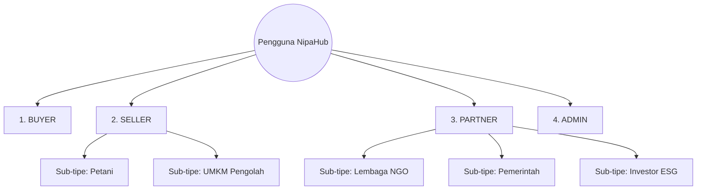

# SOFTWARE REQUIREMENT SPECIFICATION (SRS) & PRODUCT REQUIREMENTS DOCUMENT (PRD)
## NIPAHUB MARKETPLACE: BLUE ECONOMY & COASTAL EMPOWERMENT PLATFORM

---

### DAFTAR ISI
1. [Latar Belakang & Problem Statement](#1-latar-belakang--problem-statement)
2. [Business Goal, Vision, & Mission](#2-business-goal-vision--mission)
3. [Success Metrics](#3-success-metrics)
4. [Stakeholder & User Role Simplification (4 Core Roles)](#4-stakeholder--user-role-simplification-4-core-roles)
5. [User Persona & Empathy Map](#5-user-persona--empathy-map)
6. [User Journey Map](#6-user-journey-map)
7. [Proses Bisnis (As-Is vs To-Be)](#7-proses-bisnis-as-is-vs-to-be)
8. [Value Proposition & MoSCoW Prioritization](#8-value-proposition--moscow-prioritization)
9. [Functional Requirements per Modul](#9-functional-requirements-per-modul)
10. [Non-Functional Requirements (NFR)](#10-non-functional-requirements-nfr)
11. [Role & Permission Matrix](#11-role--permission-matrix)
12. [Database Schema (ERD & Relasi)](#12-database-schema-erd--relasi)
13. [API Design (REST Endpoints - Developer Friendly)](#13-api-design-rest-endpoints-developer-friendly)
14. [Rekomendasi Integrasi Eksternal API](#14-rekomendasi-integrasi-eksternal-api)
15. [Arsitektur Sistem (High-Level & Diagram)](#15-arsitektur-sistem-high-level--diagram)
16. [Uml Diagram (Activity, Sequence, State)](#16-uml-diagram-activity-sequence-state)
17. [Flowchart Proses Bisnis](#17-flowchart-proses-bisnis)
18. [Wireframe & Daftar Halaman](#18-wireframe--daftar-halaman)
19. [Dashboard & Seller Analytics](#19-dashboard--seller-analytics)
20. [Fitur Kecerdasan Buatan (AI Features)](#20-fitur-kecerdasan-buatan-ai-features)
21. [Security Architecture](#21-security-architecture)
22. [Teknologi Stack & Infrastructure](#22-teknologi-stack--infrastructure)

---

### 1. Latar Belakang & Problem Statement

#### 1.1 Project Background
Ekosistem nipah (*Nypa fruticans*) di wilayah pesisir Aceh memiliki potensi ekonomi tinggi (sebagai pemanis alami rendah glikemik, kerajinan anyaman, bioetanol, dll.) sekaligus fungsi ekologis krusial (mitigasi abrasi dan penyerapan karbon). Namun, rantai pasok tradisional yang timpang menyebabkan petani lokal tetap miskin dan hutan pesisir terancam dialihfungsikan.

**NipaHub** dirancang sebagai *vertical marketplace* berbasis *Blue Economy* untuk menghubungkan penyedia bahan baku pesisir dengan pasar digital nasional dan global secara transparan, adil, dan ramah lingkungan.

---

### 2. Business Goal, Vision, & Mission
- **Visi:** Menjadi ekosistem digital terpercaya untuk ekonomi nipah terpadu dan restorasi pesisir Nusantara.
- **Misi:**
  1. Menyediakan pasar digital adil (*fair trade*) bagi olahan nipah.
  2. Menerapkan *Traceability* (ketertelusuran produk) asal-usul nira.
  3. Mengintegrasikan donasi lingkungan langsung dari setiap transaksi pembelian.
- **Business Goal:** Mendigitalkan perdagangan nipah dengan target GMV Rp 1.5 Miliar pada tahun pertama dan pemulihan 50 Hektar kawasan mangrove pesisir.

---

### 3. Success Metrics
- **Bisnis:** Peningkatan pendapatan rata-rata pengrajin & petani mitra sebesar +40%.
- **Dampak:** Jumlah pohon bakau tertanam dan ton karbon ter-offset tercatat transparan.
- **Teknis:** Kecepatan load aplikasi < 2 detik (LCP), jaminan Uptime 99.9%.

---

### 4. Stakeholder & User Role Simplification (4 Core Roles)

Untuk mempercepat pengembangan (*time-to-market*) kompetisi dan meminimalkan kompleksitas kode, NipaHub memangkas peran pengguna dari 8 peran menjadi **4 Peran Inti**:



1.  **BUYER (Pembeli Ritel / B2B):**
    - Konsumen etis atau bisnis kuliner/kerajinan. Membeli produk, melacak pengiriman, melakukan donasi lingkungan, dan melihat histori kontribusi karbon hijau mereka.
2.  **SELLER (Mitra Produsen/Petani):**
    - Menggabungkan Petani Nipah & UMKM Pengolah. Akun ini memiliki sub-tipe (`FARMER` atau `UMKM`) untuk menentukan jenis dasbor mereka, tetapi secara RBAC menggunakan hak akses yang sama untuk memasarkan hasil bumi/olahan dan merekam data ketertelusuran produk.
3.  **PARTNER (External Impact Partner):**
    - Menggabungkan NGO (LSM Lingkungan), Pemerintah, dan Investor ESG. Mengelola proyek penanaman pohon mangrove pesisir, mengunggah bukti laporan dampak geotagging, dan mengakses laporan statistik keberlanjutan.
4.  **ADMIN (Platform Administrator):**
    - Mengelola operasional platform, verifikasi kelayakan Seller, kurasi sertifikat keaslian produk, moderasi konten ulasan, serta rekonsiliasi keuangan donasi dan penjualan.

---

### 5. User Persona & Empathy Map
*(Merujuk pada Pak Basri sebagai representasi tipe SELLER-FARMER dan Sarah Wijaya sebagai tipe BUYER).*

---

### 6. User Journey Map
*(Alur pencarian produk oleh Sarah Wijaya, memvalidasi batch ketertelusuran produk gula nipah yang diproduksi Pak Basri melalui QR Code, hingga donasi bibit bakau yang dikelola oleh Mitra PARTNER-NGO).*

---

### 7. Proses Bisnis (As-Is vs To-Be)
*(Proses To-Be disederhanakan di mana log penyadapan petani dan batch olahan UMKM diunggah ke satu modul Seller NipaHub yang terintegrasi).*

---

### 8. Value Proposition & MoSCoW Prioritization
- **Must Have:** Autentikasi dengan token JWT, Katalog Produk, Checkout + Payment Gateway (Midtrans), Logistik (Biteship), Traceability widget, Dasbor Seller (penjualan & input batch), Dasbor Buyer.
- **Should Have:** Dasbor Partner (NGO/Pemerintah/Investor) untuk kampanye donasi mangrove pesisir, Chat real-time Buyer-Seller.
- **Could Have:** AI Stock & Demand Forecasting, visualisasi peta Mapbox lokasi penanaman mangrove.

---

### 9. Functional Requirements per Modul
- **AUTH:** Pendaftaran akun dengan pilihan role (`BUYER`, `SELLER`, `PARTNER`).
- **MKT:** Unggah produk, manajemen varian, filter produk berdasarkan sertifikasi hijau.
- **TRC:** Pembuatan batch traceability, penugasan kode QR otomatis pada produk jadi.
- **DON:** Kampanye pemulihan lahan mangrove pesisir, pelaporan berkala foto geotagging oleh Partner.

---

### 10. Non-Functional Requirements (NFR)
*(Security HTTPS, rate limiting, WCAG AA, Mobile-first layout).*

---

### 11. Role & Permission Matrix

Dengan penyederhanaan menjadi 4 role, matriks hak akses CRUD menjadi sangat bersih dan mudah dikembangkan di backend:

| Role | Produk (`/api/products`) | Ketertelusuran (`/api/traceability`) | Transaksi Order (`/api/orders`) | Donasi & Kampanye (`/api/campaigns`) | Dasbor Laporan Keuangan |
| :--- | :--- | :--- | :--- | :--- | :--- |
| **ADMIN** | CRUD (Penuh) | CRUD (Penuh) | CRUD (Penuh) | CRUD (Penuh) | Ya (Seluruh Platform) |
| **SELLER** | CRUD (Milik Sendiri) | CRUD (Milik Sendiri) | Read, Update (Pesan Masuk) | Read Only | Ya (Statistik Toko) |
| **BUYER** | Read Only | Read Only | Create, Read (Milik Sendiri) | Create (Bayar Donasi) | Tidak |
| **PARTNER**| Read Only | Read Only | Tidak | CRUD (Kampanye Sendiri) | Ya (Statistik ESG/Dampak) |

---

### 12. Database Schema (ERD & Relasi)

Struktur tabel di bawah ini dirancang seefisien mungkin agar query tidak terlalu lambat saat diintegrasikan menggunakan Prisma ORM.

```
[users] 
  - id (PK)
  - email (Unique)
  - password_hash
  - fullname
  - phone
  - role (Enum: ADMIN, SELLER, BUYER, PARTNER)
  
[seller_profiles] 
  - id (PK)
  - user_id (FK -> users.id)
  - type (Enum: FARMER, UMKM)
  - brand_name
  - description
  - address
  - license_number (Halal/PIRT)
  - verified_status (Boolean)
  
[partner_profiles]
  - id (PK)
  - user_id (FK -> users.id)
  - type (Enum: NGO, GOVT, INVESTOR)
  - organization_name
  - contact_person
  - verified_status (Boolean)
```

#### Relasi Database Utama:
- `users` (1) ↔ (0..1) `seller_profiles` (One-to-One opsional).
- `users` (1) ↔ (0..1) `partner_profiles` (One-to-One opsional).
- `seller_profiles` (1) ↔ (0..*) `products` (One-to-Many).
- `products` (1) ↔ (0..*) `traceability_logs` (One-to-Many).
- `orders` (1) ↔ (1) `payments` (One-to-One).
- `orders` (1) ↔ (1) `shipping_details` (One-to-One).

---

### 13. API Design (REST Endpoints - Developer Friendly)

Untuk mempermudah integrasi Frontend-Backend, seluruh API merespons dengan **Format Respon Seragam (Unified Response Wrapper)**:

#### 🟢 Format Response Sukses (HTTP 200/201)
```json
{
  "success": true,
  "message": "Deskripsi sukses aksi",
  "data": { ... } 
}
```

#### 🔴 Format Response Gagal (HTTP 400/401/403/404/500)
```json
{
  "success": false,
  "error": {
    "code": "ERROR_CODE_IDENTIFIER",
    "message": "Pesan kesalahan yang mudah dipahami pengguna",
    "details": [] 
  }
}
```

#### 13.1 Modul: Autentikasi (`/api/auth`)
- **POST `/api/auth/register`** -> Pendaftaran pengguna baru.
- **POST `/api/auth/login`** -> Verifikasi kredensial dan pengembalian token JWT.
- **GET `/api/auth/me`** -> Mengambil data profil login saat ini (memakai JWT header).

#### 13.2 Modul: Produk & Marketplace (`/api/products`)
- **GET `/api/products`** -> Mengambil semua produk dengan pagination, filter kategori, dan pencarian teks.
- **GET `/api/products/:id`** -> Mengambil detail produk tunggal beserta informasi profil toko Seller.
- **POST `/api/products`** -> (*Seller/Admin*) Menambahkan produk baru.
- **PUT `/api/products/:id`** -> (*Seller/Admin*) Memperbarui produk.
- **DELETE `/api/products/:id`** -> (*Seller/Admin*) Menghapus produk.

#### 13.3 Modul: Lacak Ketertelusuran (`/api/traceability`)
- **GET `/api/traceability/batch/:code`** -> Mengambil runtutan lini masa ketertelusuran produk dari petani penyadap hingga UMKM.
- **POST `/api/traceability/batch`** -> (*Seller*) Mendaftarkan batch produksi baru dan menghubungkannya dengan petani pemasok bahan baku.

#### 13.4 Modul: Pesanan & Transaksi (`/api/orders`)
- **POST `/api/orders`** -> (*Buyer*) Membuat pesanan pembelian baru (termasuk donasi opsional).
- **GET `/api/orders/:id`** -> Mengambil rincian pesanan dan status pelacakannya.
- **POST `/api/orders/:id/payment`** -> Memicu pembayaran via token snap Midtrans.
- **POST `/api/orders/webhook/midtrans`** -> Endpoint publik untuk menerima konfirmasi transaksi real-time dari Midtrans.

#### 13.5 Modul: Kampanye & Donasi Dampak (`/api/campaigns`)
- **GET `/api/campaigns`** -> List kampanye restorasi pesisir yang aktif.
- **POST `/api/campaigns`** -> (*Partner-NGO/Admin*) Membuat kampanye baru.
- **POST `/api/campaigns/:id/donate`** -> (*Buyer/Partner*) Melakukan donasi langsung ke proyek restorasi tertentu.

---

### 14. Rekomendasi Integrasi Eksternal API
*(Midtrans untuk pembayaran, Biteship untuk kurir multi-ekspedisi, Mapbox untuk pemetaan koordinat, Resend untuk email).*

---

### 15. Arsitektur Sistem (High-Level & Diagram)
*(Modular Monolith NestJS/Express.js & Next.js Frontend untuk kecepatan development).*

---

### 16. UML Diagrams
*(Activity, Sequence, State diagram disesuaikan dengan struktur 4 role).*

---

### 17. Flowchart Proses Bisnis
*(Diagram alur dari log panen petani Seller -> Produksi UMKM Seller -> Order Buyer -> Donasi Partner NGO).*

---

### 18. Wireframe & Daftar Halaman
*(Landing Page, Catalog, Detail Produk, Dashboard Buyer, Dashboard Seller, Dashboard Partner, Console Admin).*

---

### 19. Dashboard & Seller Analytics
*(Grafik penjualan bulanan, prediksi kebutuhan stok bahan baku berbasis AI).*

---

### 20. Fitur Kecerdasan Buatan (AI Features)
- **AI Demand Forecasting:** Prediksi volume nira nipah musiman untuk Seller.
- **AI Recommendation Engine:** Rekomendasi produk berbasis dampak karbon paling minim bagi Buyer.

---

### 21. Security Architecture
- JWT tokens disimpan secara aman di client (HttpOnly Cookies).
- RBAC Middleware di backend NestJS/Express menguji kecocokan `req.user.role` pada setiap rute privat.

---

### 22. Teknologi Stack & Infrastructure
- **Frontend:** Next.js, Tailwind CSS, Shadcn UI, Zustand.
- **Backend:** NestJS / Express.js, Prisma ORM, PostgreSQL.
- **Hosting:** Vercel (Frontend), Railway / Render (Backend).
